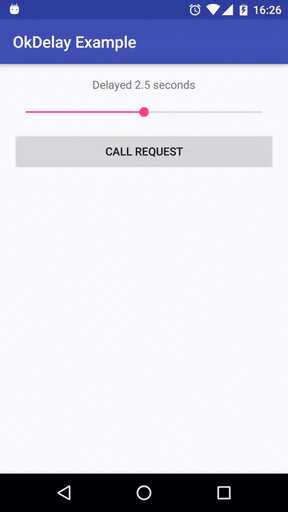

# OkHttp Delay Interceptor [](https://travis-ci.org/pawel-schmidt/okhttp-delay-interceptor) [](https://jitpack.io/#pawel-schmidt/okhttp-delay-interceptor)
OkHttp Interceptor implementation which allows to mock weak connection.



## Usage
Add library to project dependencies.

```groovy
repositories {
    maven { url "https://jitpack.io" }
}

dependencies {

    // snapshot version
    compile 'com.github.pawel-schmidt/okhttp-delay-interceptor:master-SNAPSHOT'

    // or use specific version
    compile 'com.github.pawel-schmidt/okhttp-delay-interceptor:0.0.1'
}
```

Add a following lines to your code.

```java
// create OkHttpClient with fixed time DelayInterceptor…
final OkHttpClient fixedDelayClient = new OkHttpClient.Builder()
        .addInterceptor(new DelayInterceptor(1500L, TimeUnit.MILLISECONDS))
        .build();

// … or create OkHttpClient with flexible time DelayInterceptor…
final SimpleDelayProvider simpleDelayProvider = 
        new SimpleDelayProvider(1500L, TimeUnit.MILLISECONDS);
final OkHttpClient flexibleDelayClient = new OkHttpClient.Builder()
        .addInterceptor(new DelayInterceptor(simpleDelayProvider))
        .build();
// … and change delay whenever you want
simpleDelayProvider.setDelay(5L, TimeUnit.SECONDS);
```

## Build instructions

```bash
./gradlew build
```

## License

    Copyright 2016 Paweł Schmidt
    
    Licensed under the Apache License, Version 2.0 (the "License");
    you may not use this file except in compliance with the License.
    You may obtain a copy of the License at
    
        http://www.apache.org/licenses/LICENSE-2.0
    
    Unless required by applicable law or agreed to in writing, software
    distributed under the License is distributed on an "AS IS" BASIS,
    WITHOUT WARRANTIES OR CONDITIONS OF ANY KIND, either express or implied.
    See the License for the specific language governing permissions and
    limitations under the License.
